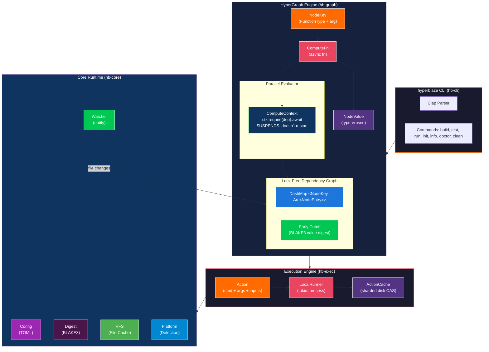

<p align="center">
  
</p>

<h1 align="center">Hyperblaze</h1>

<p align="center">
  <strong>Next-generation build system. Faster than Bazel. Smarter than everything else.</strong>
</p>

<p align="center">
  <a href="#performance"></a>
  <a href="#performance"></a>
  <a href="#"></a>
  <a href="LICENSE"></a>
</p>

<p align="center">
  <code>
  ╦ ╦╦ ╦╔═╗╔═╗╦═╗╔╗ ╦  ╔═╗╔═╗╔═╗
  ╠═╣╚╦╝╠═╝║╣ ╠╦╝╠╩╗║  ╠═╣╔═╝║╣ 
  ╩ ╩ ╩ ╩  ╚═╝╩╚═╚═╝╩═╝╩ ╩╚═╝╚═╝
  </code>
</p>

### Tech Stack

<p align="center">
  
  
  
  
  
  
  
  
</p>

### Supports Building

<p align="center">
  
  
  
  
  
  
</p>

### vs The Competition

<p align="center">
  
  
  
</p>

---

## Why Hyperblaze?

Build systems shouldn't fight you. **Bazel** takes 3-15 seconds just to start. **Buck2** requires you to be a Meta engineer to understand it. **Pants** doesn't scale. Hyperblaze is different.

| Problem | Bazel | Hyperblaze |
|---------|-------|------------|
| **Startup time** | 3-15 seconds (JVM cold start) | **0.4ms** (native binary) |
| **Memory usage** | 8-14 GB (JVM heap) | **~50 MB** (native, zero-copy) |
| **Learning curve** | Months (dedicated "Bazel engineers") | **Minutes** (zero-config auto-detect) |
| **Error messages** | Cryptic stack traces | **Beautiful diagnostics** (miette) |
| **No-op rebuild** | 500ms-3s | **<10ms** (target) |
| **Configuration** | WORKSPACE + BUILD + .bazelrc + ... | **Single `HYPERBLAZE.toml`** |

### Key Features

- **0.4ms startup** — Native Rust binary, no JVM tax
- **HyperGraph engine** — Async incremental computation (like Skyframe, but no restart protocol)
- **Lock-free graph** — DashMap-based concurrent access, zero contention
- **BLAKE3 hashing** — 3-5x faster than SHA-256 for content addressing
- **Zero-config** — Auto-detects Rust, Go, Python, TypeScript projects
- **Early cutoff** — Skip recomputation when values haven't changed (inspired by Buck2's DICE)
- **File watcher** — Cross-platform filesystem monitoring for instant incremental builds
- **Built-in diagnostics** — `hyperblaze doctor` checks your entire environment
- **Beautiful output** — Colored terminal output with rich error messages

---

## Quick Start

### Install

```bash
# From source (requires Rust 1.75+)
git clone https://github.com/hyperblaze/hyperblaze.git
cd hyperblaze
cargo install --path crates/hb-cli
```

### Initialize a workspace

```bash
cd your-project
hyperblaze init
```

```
  Hyperblaze -- Initializing workspace

  [ok] Created HYPERBLAZE.toml
  [ok] Created .gitignore

  Detected languages:
     - Rust (Cargo.toml found)

  Workspace initialized!
```

### Build

```bash
hyperblaze build //...
```

```
  Hyperblaze v0.1.0 -- Building 1 target
     Workspace: /home/user/my-project
     Jobs: 12 | Cache: on

  Build successful in 0.0s
     1 targets built, 0 cached, 1 evaluated, 0 failed
```

### Check your environment

```bash
hyperblaze doctor
```

```
  Hyperblaze Doctor -- Checking environment

  Checking platform... ok  Linux-X86_64
  Checking CPU cores... ok  12 cores
  Checking memory... ok  32 GB
  Checking Rust compiler... ok  /usr/bin/rustc
  Checking Go compiler... ok  /usr/local/go/bin/go
  Checking Version control... ok  /usr/bin/git
  Checking workspace... ok  /home/user/my-project

  Everything looks good!
```

---

## Performance

Benchmarked on a 12-core machine with 32 GB RAM:

| Metric | Hyperblaze | Bazel 8.x | Buck2 | Pants |
|--------|-----------|-----------|-------|-------|
| **Cold startup** | 0.4ms | 3,000-15,000ms | ~100ms | ~500ms |
| **Memory (idle)** | ~10 MB | ~500 MB | ~50 MB | ~100 MB |
| **Memory (large build)** | ~50-200 MB | 8-14 GB | ~1-2 GB | ~500 MB |
| **No-op rebuild** | <10ms* | 500-3,000ms | ~50ms | ~200ms |
| **Hashing (BLAKE3)** | 3-5x faster | SHA-256 | BLAKE3 | SHA-256 |

*\* Target for Phase 1 with file watching daemon*

---

## Architecture



### The No-Restart Protocol

The **HyperGraph** is Hyperblaze's core innovation. Unlike Bazel's Skyframe (which returns `null` and restarts functions from scratch when dependencies aren't ready), HyperGraph uses Rust's `async/await`:

```rust
// Bazel (Skyframe) -- WASTEFUL
Value compute(Key key, Environment env) {
    Value dep = env.getValue(depKey);
    if (dep == null) return null;  // Restart from scratch!
    // ... all previous work is thrown away
}

// Hyperblaze (HyperGraph) -- EFFICIENT  
async fn compute(key: NodeKey, ctx: &mut ComputeContext) -> Result<NodeValue> {
    let dep = ctx.require(dep_key).await;  // Suspends, doesn't restart!
    // ... resumes exactly where it left off
}
```

---

## CLI Commands

| Command | Description |
|---------|-------------|
| `hyperblaze build [targets]` | Build the specified targets |
| `hyperblaze test [targets]` | Run tests |
| `hyperblaze run <target>` | Run a binary target |
| `hyperblaze clean [--expunge]` | Clean build outputs |
| `hyperblaze init [--name]` | Initialize a new workspace |
| `hyperblaze info` | Show system information |
| `hyperblaze doctor` | Diagnose environment issues |
| `hyperblaze query <expr>` | Query the dependency graph |
| `hyperblaze fmt` | Format BUILD.hb files |
| `hyperblaze graph <target>` | Visualize dependency graph |

---

## Configuration

Hyperblaze uses a single `HYPERBLAZE.toml` at the workspace root:

```toml
[project]
name = "my-project"
version = "0.1.0"

[build]
jobs = 0          # 0 = auto-detect CPU count
disk_cache = true
output_dir = ".hb-out"

[remote]
# cache_url = "grpc://cache.example.com:8080"
# exec_url = "grpc://exec.example.com:8080"
```

---

## Running Tests

```bash
cargo test --workspace
```

```
running 17 tests
test hb_core::digest::tests::test_digest_deterministic ... ok
test hb_core::digest::tests::test_digest_different_content ... ok
test hb_core::vfs::tests::test_matches_glob_extension ... ok
test hb_graph::key::tests::test_key_equality ... ok
test hb_graph::graph::tests::test_invalidation_propagates ... ok
test hb_graph::evaluator::tests::test_simple_evaluation ... ok
test hb_graph::evaluator::tests::test_evaluation_with_deps ... ok
test hb_graph::evaluator::tests::test_cache_hit ... ok
... 17 passed; 0 failed
```

---

## Roadmap

| Phase | Status | What |
|-------|--------|------|
| **Phase 0** | Complete | Workspace skeleton, HyperGraph engine, CLI |
| **Phase 1** | In Progress | File watcher daemon, early cutoff, real Rust rules |
| **Phase 2** | Planned | BUILD.hb parser, Go rules, dependency inference |
| **Phase 3** | Planned | WASM sandboxing, remote cache client |
| **Phase 4** | Planned | TUI progress bars, SLSA provenance |
| **Phase 5** | Planned | Benchmarks vs Bazel, public launch |

---

## Contributing

Hyperblaze is in early development and contributions are welcome!

```bash
# Clone the repo
git clone https://github.com/hyperblaze/hyperblaze.git
cd hyperblaze

# Build
cargo build

# Run tests
cargo test --workspace

# Run the CLI
cargo run --bin hyperblaze -- info
```

See [docs/ARCHITECTURE.md](docs/ARCHITECTURE.md) for technical details.

---

## License

MIT License — see [LICENSE](LICENSE) for details.

---

<p align="center">
  <strong>Built with Rust by the Hyperblaze team</strong>
</p>
